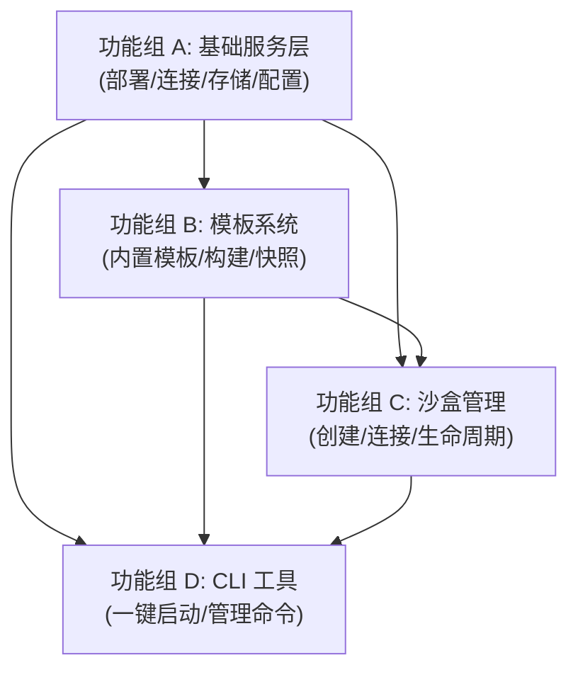

# Sandbox Manager MVP - 产品规格文档

> 版本: 2.0 (MVP) | 日期: 2026-04-09 | 状态: 规划阶段

---

## 一、产品愿景

**一条命令，秒级进入预装好 Claude Code / VS Code / OpenClaw 的隔离开发环境。**

用户不需要手动安装任何工具，不需要等待环境配置。内置模板已经预装好一切，创建即连接，连接即可用。

---

## 二、核心价值主张

| 维度 | 现状（手动配置） | Sandbox Manager |
|------|-----------------|-----------------|
| 环境准备 | 每次手动安装依赖，耗时 10-30 分钟 | 内置模板预装好一切，创建即用 |
| 环境隔离 | 直接在宿主机操作，互相污染 | Docker 容器隔离，互不影响 |
| 环境复用 | 记不住装了什么，无法复制 | 运行时快照保存当前状态，随时复用 |
| 连接体验 | 需要知道容器名、端口号、连接方式 | 自适应连接 -- 自动判断该 shell 进去还是打开浏览器 |

**差异化定位**: 不是做通用沙盒平台，而是做**个人开发者的开箱即用环境管理工具**。核心体验是"快"和"省心"。

---

## 三、目标用户与使用场景

### 目标用户

**个人开发者** -- 在本地使用 AI 开发工具（Claude Code、VS Code、OpenClaw），需要快速获得干净的预配置环境。

典型画像:
- 需要在多个项目间切换，每个项目需要不同的工具组合
- 不想在宿主机上装太多东西，偏好隔离环境
- 偶尔想保存当前环境状态，下次直接用

### 核心使用场景

**场景 1: 即开即用（最高频）**
> "我要用 Claude Code 做个项目"
> `sbx start claude-code` -> 3 秒后进入预装好 Claude Code 的终端

**场景 2: 保存环境（中频）**
> "这个环境我又装了些东西，想保存下来"
> `sbx snapshot my-sandbox --name my-custom-env` -> 保存为自定义模板

**场景 3: 管理清理（低频）**
> "看看有哪些沙盒在跑，关掉不用的"
> `sbx list` -> 查看所有沙盒
> `sbx stop my-sandbox` -> 停掉

**场景 4: 自定义模板（偶尔）**
> "我想定义自己的模板，预装特定工具"
> 编写模板配置 -> `sbx template build my-template` -> 构建完成

---

## 四、技术约束

| 约束 | 说明 |
|------|------|
| 后端框架 | Python FastAPI，作为常驻服务运行 |
| 沙盒运行时 | 阿里开源 OpenSandbox (Docker 运行时) |
| 快照机制 | docker commit（文件系统快照，不含内存/进程状态） |
| 元数据存储 | SQLite |
| CLI 框架 | Python Typer |
| 部署方式 | docker-compose（OpenSandbox server + Sandbox Manager 服务） |
| 启动速度 | 目标 <=3s（本地 Docker 镜像启动） |

---

## 五、功能清单

### 功能组 A: 基础服务层 -- 让系统跑起来

这是整个系统的地基。如果部署不顺、连接不通，后面的一切都无从谈起。

**1. docker-compose 一键部署**
- 用户故事: 作为开发者，我要能用一条命令启动整个系统（OpenSandbox server + Sandbox Manager 服务），而不是手动逐个启动各组件。
- 验收标准:
  - `docker-compose up` 启动后，OpenSandbox server 和 Sandbox Manager API 服务均可达
  - 首次启动时自动完成数据库初始化
  - 停止后 `docker-compose up` 重新启动，之前的模板数据不丢失

**2. OpenSandbox 连接管理**
- 用户故事: 作为系统，我需要在启动时验证 OpenSandbox server 是否可达，并在后续操作中维护与 OpenSandbox 的通信。
- 验收标准:
  - 服务启动时检测 OpenSandbox 连通性，不可达时在日志中输出明确错误信息
  - 对 OpenSandbox 的调用有合理的超时和重试策略
  - OpenSandbox 临时不可用时，相关操作返回有意义的错误而非挂起

**3. 数据库初始化与元数据管理**
- 用户故事: 作为系统，我需要持久化存储模板和沙盒的元数据，确保服务重启后数据不丢失。
- 验收标准:
  - 首次启动自动创建数据库和表结构
  - 模板信息（名称、描述、类型、镜像引用、连接方式等）持久化存储
  - 沙盒信息（ID、关联模板、状态、创建时间等）持久化存储
  - 服务重启后所有数据可正常查询

**4. 配置管理**
- 用户故事: 作为开发者，我要能通过配置文件或环境变量自定义系统行为（OpenSandbox 地址、默认超时等），而不是修改代码。
- 验收标准:
  - 支持配置项: OpenSandbox server 地址、API key、数据库路径、默认沙盒超时时间、Docker 镜像前缀
  - 优先级: 默认值 < 配置文件 < 环境变量
  - 配置缺失时使用合理默认值，不报错

---

### 功能组 B: 模板系统 -- 开箱即用的核心（依赖 A）

这是产品的核心差异化功能。内置模板让用户跳过所有环境配置步骤。

**5. 内置模板注册**
- 用户故事: 作为开发者，我要在系统首次启动后就能看到预定义的内置模板（claude-code、vscode、openclaw、python-dev），不需要自己配置。
- 验收标准:
  - 系统启动时自动检测内置模板配置是否存在
  - 4 个内置模板的配置随代码分发：
    - `claude-code`: Ubuntu + Node.js + Claude Code CLI，连接类型 shell
    - `vscode`: Ubuntu + code-server，连接类型 url
    - `openclaw`: Ubuntu + OpenClaw Gateway，连接类型 shell + port
    - `python-dev`: Python 3.11 + numpy/pandas/matplotlib，连接类型 shell
  - 未构建的模板状态标记为"未构建"，已构建的标记为"就绪"

**6. 模板配置解析**
- 用户故事: 作为开发者，我要能通过声明式配置文件定义自己的模板（基础镜像、安装命令、环境变量、启动命令、连接方式），而不是写 Dockerfile。
- 验收标准:
  - 支持 YAML 格式模板配置文件
  - 配置至少包含: 基础镜像、安装命令列表、环境变量、启动命令、就绪检查命令、连接类型（shell/url/port）、连接参数
  - 配置校验: 缺少必填字段时报告具体错误位置
  - 提供配置文件生成命令，创建带注释的脚手架文件

**7. 模板构建流程**
- 用户故事: 作为开发者，我要能把模板配置构建为可用的 Docker 镜像，构建过程有进度反馈，失败时有明确的错误信息。
- 验收标准:
  - 构建流程: 创建临时沙盒 -> 依次执行安装命令 -> 运行就绪检查 -> docker commit 保存镜像 -> 注册模板元数据
  - 构建过程中每一步有进度输出（正在执行哪条命令）
  - 某一步安装命令失败时，停止构建并报告是哪条命令失败、失败原因（exit code + stderr）
  - 构建成功后输出镜像大小信息
  - 构建是异步操作，不阻塞 API 服务其他请求
  - 可以查询正在进行中的构建状态

**8. 模板 CRUD**
- 用户故事: 作为开发者，我要能查看所有模板、查看模板详情、删除不需要的模板。
- 验收标准:
  - 列出所有模板: 名称、描述、状态（就绪/构建中/未构建/构建失败）、连接类型、镜像大小、创建时间
  - 查看模板详情: 包含完整构建配置信息
  - 删除模板: 同时清理对应的 Docker 镜像，释放磁盘空间
  - 内置模板可以删除后重新构建

**9. 运行时快照**
- 用户故事: 作为开发者，我在沙盒里装了额外的东西之后，想把当前状态保存为新模板，下次直接复用。
- 验收标准:
  - 对运行中的沙盒执行快照，生成新的 Docker 镜像并注册为模板
  - 快照时自动暂停容器（Docker-level pause）保证文件系统一致性，完成后自动恢复
  - 支持自定义模板名称和描述
  - 快照生成的模板继承原模板的连接类型和启动命令（可覆盖）
  - 快照完成后输出新模板名称和镜像大小

---

### 功能组 C: 沙盒管理 -- 创建、连接、管理（依赖 A + B）

让用户能从模板创建沙盒、连接进去使用、管理生命周期。

**10. 从模板创建沙盒**
- 用户故事: 作为开发者，我要能从任意已构建的模板创建沙盒，创建后沙盒立即可用。
- 验收标准:
  - 指定模板名创建沙盒，返回沙盒 ID
  - 启动时间 <=3s（本地镜像）
  - 创建后自动执行模板定义的启动命令
  - 如果模板定义了就绪检查，等待就绪后才标记沙盒为可用
  - 模板未构建时，给出明确提示（而非创建失败的通用错误）

**11. 自适应连接**
- 用户故事: 作为开发者，我不想记住每种工具该用什么方式连接。系统应该根据模板类型自动选择最合适的连接方式。
- 验收标准:
  - shell 类型（claude-code, python-dev）: 执行 `docker exec -it sandbox-{id} /bin/bash` 进入交互终端
  - url 类型（vscode/code-server）: 获取端口映射地址，自动在浏览器中打开
  - port 类型（openclaw）: 打印端口映射信息，提示用户如何访问
  - 连接前检查沙盒状态，如果沙盒未运行给出提示
  - 从 shell 退出后沙盒继续运行（不被销毁）

**12. 沙盒列表与状态**
- 用户故事: 作为开发者，我要能查看当前有哪些沙盒在运行、它们的状态、关联的模板。
- 验收标准:
  - 列出所有沙盒: ID（或简短标识）、关联模板名、状态（running/paused/stopped）、创建时间、连接类型
  - 支持按状态筛选
  - 输出格式友好，表格对齐

**13. 沙盒暂停与恢复**
- 用户故事: 作为开发者，我暂时不用某个沙盒但稍后还想继续，想暂停它节省资源。
- 验收标准:
  - 暂停沙盒后不消耗 CPU（cgroup freeze）
  - 恢复后沙盒内环境与暂停前一致
  - 暂停/恢复操作有明确的状态反馈

**14. 沙盒销毁**
- 用户故事: 作为开发者，我要能销毁不需要的沙盒，释放资源。
- 验收标准:
  - 销毁沙盒后 Docker 容器被移除
  - 可以单个销毁，也可以批量销毁所有沙盒
  - 销毁前如果沙盒仍在运行，给出确认提示（CLI 层面）

---

### 功能组 D: CLI 工具 -- 用户直接交互的界面（依赖 A + B + C）

CLI 是用户触达系统的唯一界面（MVP 阶段）。命令设计应简洁直觉。

**15. 一键启动命令（核心体验）**
- 用户故事: 作为开发者，我要能用一条命令完成"从模板创建沙盒 + 自动连接"，最大程度减少操作步骤。
- 验收标准:
  - `sbx start <template-name>` 一条命令完成: 创建沙盒 -> 等待就绪 -> 自适应连接
  - 如果模板未构建，提示用户先构建或自动触发构建
  - 创建过程有简洁的进度提示（"正在创建..."、"正在连接..."）
  - 整个过程从敲命令到进入可用环境 <=5s（本地镜像，不含构建时间）

**16. 沙盒管理命令组**
- 用户故事: 作为开发者，我要能通过 CLI 管理沙盒的生命周期。
- 验收标准:
  - `sbx list` -- 表格展示所有沙盒
  - `sbx connect <sandbox-id>` -- 连接到已有沙盒（自适应连接）
  - `sbx stop <sandbox-id>` -- 停止沙盒
  - `sbx stop --all` -- 停止所有沙盒
  - `sbx rm <sandbox-id>` -- 销毁沙盒
  - `sbx rm --all` -- 销毁所有沙盒
  - `sbx pause <sandbox-id>` -- 暂停沙盒
  - `sbx resume <sandbox-id>` -- 恢复沙盒
  - 所有命令支持 `--json` 输出格式（方便脚本使用）
  - 所有命令操作成功/失败有明确反馈

**17. 模板管理命令组**
- 用户故事: 作为开发者，我要能通过 CLI 查看、构建、管理模板。
- 验收标准:
  - `sbx template list` -- 表格展示所有模板及状态
  - `sbx template build <template-name>` -- 构建指定模板（有实时进度输出）
  - `sbx template build --all` -- 构建所有未构建的内置模板
  - `sbx template init <name>` -- 生成模板配置文件脚手架
  - `sbx template rm <template-name>` -- 删除模板
  - `sbx template show <template-name>` -- 查看模板详情
  - `sbx snapshot <sandbox-id> --name <name>` -- 将运行中沙盒保存为模板

**18. 系统管理命令**
- 用户故事: 作为开发者，我要能查看系统状态和管理配置。
- 验收标准:
  - `sbx status` -- 显示系统状态: API 服务是否运行、OpenSandbox 是否可达、活跃沙盒数、已构建模板数
  - `sbx config show` -- 显示当前配置
  - `sbx config set <key> <value>` -- 修改配置项
  - `sbx version` -- 显示版本信息

---

## 六、功能组依赖关系



简述:
- A 是无外部依赖的基础层
- B 依赖 A（需要 OpenSandbox 连接和数据库）
- C 依赖 A + B（从模板创建沙盒）
- D 依赖 A + B + C（CLI 是所有功能的用户界面层）

注意: D 虽然"依赖"前三个功能组，但 CLI 命令的骨架（命令定义、参数解析、输出格式）可以与后端逻辑并行开发。真正的依赖是 CLI 命令需要调用后端 API 才能实际工作。

---

## 七、QA 里程碑

| 里程碑 | 触发条件 | 交付物 | 评审重点 | 阻塞风险 |
|--------|---------|--------|---------|---------|
| **QA-M1** | 功能组 A + B 完成 | docker-compose 可启动；内置模板可构建；模板 CRUD 可用 | (1) docker-compose up 后系统完全可用 (2) 4 个内置模板能成功构建 (3) 模板构建失败时的错误处理是否清晰 (4) 快照是否可靠（docker commit + pause 协调） | **最高风险**。如果 OpenSandbox 集成有问题或 docker commit 流程不可靠，后续全部白费 |
| **QA-M2** | 功能组 C 完成 | 沙盒可从模板创建；自适应连接可用；生命周期管理可用 | (1) 从 4 个模板各创建沙盒，启动时间 <=3s (2) 三种连接方式（shell/url/port）均正常工作 (3) 暂停/恢复后环境一致 (4) 销毁后资源完全释放 | 中等风险。自适应连接是用户体验核心 |
| **QA-M3** | 功能组 D 完成 | 所有 CLI 命令可用；端到端体验流畅 | (1) `sbx start claude-code` 端到端 <=5s 进入可用环境 (2) 所有命令的错误提示是否对用户友好 (3) 输出格式是否整洁易读 (4) 模板未构建时的引导流程是否顺畅 | 较低风险，但直接影响用户第一印象 |

### 各里程碑验收场景

#### QA-M1 验收场景

```
部署验证:
1. git clone 项目 -> docker-compose up -> 服务启动成功
2. 查看日志 -> OpenSandbox 连接成功、数据库初始化成功
3. docker-compose down -> docker-compose up -> 之前的数据仍在

模板系统验证:
4. 查看模板列表 -> 4 个内置模板状态为"未构建"
5. 构建 python-dev 模板 -> 构建过程有进度输出 -> 构建成功
6. 构建 claude-code 模板 -> 构建成功
7. 构建 vscode 模板 -> 构建成功
8. 构建 openclaw 模板 -> 构建成功
9. 查看模板列表 -> 4 个模板状态为"就绪"，显示镜像大小
10. 查看 python-dev 详情 -> 配置信息完整

快照验证:
11. 创建沙盒 -> 在沙盒内安装额外工具 -> 执行快照 -> 成功生成新模板
12. 从新模板创建沙盒 -> 额外工具可用（证明快照有效）
13. 删除模板 -> Docker 镜像被清理

错误处理验证:
14. 构建一个故意会失败的模板（安装不存在的包）-> 报告具体失败命令和错误
15. 停止 OpenSandbox server -> 尝试操作 -> 返回明确连接错误
```

#### QA-M2 验收场景

```
沙盒创建与连接:
1. 从 claude-code 模板创建沙盒 -> 启动 <=3s -> shell 连接进入终端 -> claude-code 命令可用
2. 从 vscode 模板创建沙盒 -> 启动 <=3s -> 获取 URL -> 浏览器可访问 code-server
3. 从 openclaw 模板创建沙盒 -> 启动 <=3s -> 获取端口信息
4. 从 python-dev 模板创建沙盒 -> 启动 <=3s -> shell 连接 -> python3 -c "import numpy" 成功

生命周期管理:
5. 列出所有沙盒 -> 显示 4 个运行中的沙盒
6. 暂停 python-dev 沙盒 -> 状态变为 paused
7. 恢复 python-dev 沙盒 -> 状态变为 running -> 重新连接 -> 之前安装的东西还在
8. 销毁单个沙盒 -> 容器被移除 -> 列表中不再显示
9. 批量销毁所有沙盒 -> 所有容器被移除

边界情况:
10. 连接一个已暂停的沙盒 -> 提示沙盒已暂停
11. 连接一个不存在的沙盒 -> 提示沙盒不存在
12. 从未构建的模板创建沙盒 -> 提示模板未构建
```

#### QA-M3 验收场景

```
核心体验（最重要）:
1. sbx start claude-code -> 从敲命令到进入终端 <=5s -> claude 命令可用
2. sbx start vscode -> 浏览器自动打开 code-server
3. sbx start python-dev -> 进入终端 -> python3 可用

管理命令:
4. sbx list -> 整洁表格，列宽自适应
5. sbx connect <id> -> 连接到已有沙盒
6. sbx stop <id> -> 停止沙盒
7. sbx stop --all -> 停止所有
8. sbx rm <id> -> 销毁沙盒
9. sbx pause <id> / sbx resume <id> -> 暂停/恢复
10. sbx template list -> 显示模板列表和状态
11. sbx template build --all -> 构建所有未构建模板，有进度
12. sbx snapshot <id> --name my-env -> 保存当前沙盒为模板

引导体验:
13. 首次使用 sbx start claude-code（模板未构建）-> 提示需要构建 -> 引导用户执行构建
14. sbx status -> 清晰展示系统状态

错误体验:
15. API 服务未启动 -> sbx 命令给出明确提示而非连接超时
16. 输入错误的模板名 -> 提示不存在并列出可用模板
17. 输入错误的沙盒 ID -> 提示不存在

JSON 输出:
18. sbx list --json -> 输出合法 JSON
```

---

## 八、跨功能关注点

### 8.1 核心数据实体

系统有两个核心实体:

- **Template (模板)**: 沙盒的蓝图。包含构建配置（基础镜像、安装步骤等）和构建产物（Docker 镜像引用）。有"内置"和"自定义"两种来源，自定义模板又分为"配置构建"和"快照生成"两种方式。每个模板有明确的连接类型（shell/url/port）。

- **Sandbox (沙盒)**: 运行中的隔离环境实例。始终关联一个 Template。有明确的状态机: creating -> running <-> paused -> stopped。

关系: Template 1:N Sandbox（一个模板可创建多个沙盒）。Sandbox 可通过快照生成 Template。

### 8.2 连接方式设计

连接方式是模板级别的属性（不是沙盒级别），在模板配置中声明:

| 连接类型 | 触发方式 | 典型模板 |
|---------|---------|---------|
| shell | `docker exec -it sandbox-{id} /bin/bash` | claude-code, python-dev |
| url | 获取端口映射地址，用系统默认浏览器打开 | vscode (code-server) |
| port | 打印端口映射表，用户自行访问 | openclaw |

一个模板可以有主连接方式 + 辅助信息（如 openclaw 主要是 shell，但也输出端口信息）。

### 8.3 OpenSandbox 与 Docker 双层交互

系统同时与两层交互:
- **OpenSandbox SDK**: 沙盒创建、暂停/恢复、销毁（高层抽象，管理沙盒生命周期）
- **Docker CLI/API**: docker commit（快照）、容器命名查找、端口映射查询（底层操作）

协调原则: OpenSandbox 管理容器生命周期，Docker 操作只在 OpenSandbox 操作不足时补充（快照、端口查询）。快照操作前后需要通过 Docker-level pause/unpause 保证一致性。

### 8.4 错误处理策略

分两类:
- **用户错误**（模板不存在、沙盒已停止等）: 返回明确的提示信息，尽可能给出下一步建议（如"模板未构建，请先执行 sbx template build xxx"）
- **系统错误**（OpenSandbox 不可达、Docker 异常等）: 返回简洁的错误描述，详细信息记录在日志中

CLI 层面额外原则: 用户看到的错误信息应当是**可操作的** -- 告诉用户该怎么办，而不只是告诉用户出了什么错。

### 8.5 API 设计原则

FastAPI 服务作为内部 API（CLI -> API -> OpenSandbox），MVP 阶段不对外暴露:
- 所有操作通过 REST API 端点暴露
- 统一响应格式
- 异步操作（如模板构建）通过状态查询跟踪进度
- FastAPI 自动生成 OpenAPI 文档，便于调试

---

## 九、风险识别

### 风险 1: OpenSandbox 集成稳定性 [高]
**描述**: 系统完全依赖 OpenSandbox server。如果 OpenSandbox 有 bug 或行为不符合预期，会直接阻塞开发。
**缓解**: QA-M1 的首要评审项。集成层做好抽象，隔离对 OpenSandbox 的直接依赖。

### 风险 2: docker commit 快照可靠性 [高]
**描述**: docker commit 与 OpenSandbox 对同一容器的并发操作可能导致状态不一致。快照不含进程内存状态，恢复后需要重启服务。
**缓解**: 快照前 Docker-level pause，完成后 unpause。模板配置必须包含启动命令。

### 风险 3: 内置模板安装过程不确定性 [中]
**描述**: 模板构建需要在线安装包（pip install、apt install、npm install），网络问题或包版本变化可能导致构建失败。
**缓解**: 内置模板配置中尽量锁定版本。构建失败时错误信息明确指出失败步骤。

### 风险 4: 启动速度不达标 [中]
**描述**: 1-3s 目标基于本地小镜像。如果模板镜像较大（GB 级），启动可能超出预期。
**缓解**: 控制内置模板镜像大小。构建完成后输出镜像大小作为参考。

---

## 十、MVP 不做的功能（明确排除）

| 功能 | 排除原因 |
|------|---------|
| Python SDK | MVP 用户通过 CLI 交互，编程集成后续再做 |
| Web UI | CLI 足够，Web UI 是独立项目 |
| 资源限制（CPU/内存） | 个人开发者场景不迫切 |
| 自动清理（超时/僵尸沙盒） | 手动管理足够，后续增强 |
| 审计日志 | 个人使用不需要 |
| Webhook 通知 | 无外部系统集成需求 |
| 模板版本管理 | 多版本是高级功能 |
| 网络隔离策略 | 个人开发者场景不迫切 |
| 沙盒文件读写 API | shell 交互已覆盖 |
| 沙盒命令执行 API | shell 交互已覆盖 |
| 沙盒续期 | 手动暂停/恢复已覆盖 |
| 多租户 | 单用户场景 |
| 集群调度 | 单机部署 |

---

## 附录 A: 内置模板清单

| 模板名 | 基础镜像 | 预装内容 | 连接类型 | 用途 |
|--------|---------|---------|---------|------|
| claude-code | ubuntu:22.04 | Node.js 20 LTS, Claude Code CLI | shell | AI 辅助编码 |
| vscode | ubuntu:22.04 | code-server (VS Code Web) | url | 浏览器内 IDE |
| openclaw | ubuntu:22.04 | OpenClaw Gateway | shell + port | OpenClaw 网关 |
| python-dev | ubuntu:22.04 | Python 3.11, pip, numpy, pandas, matplotlib | shell | Python 开发 |

---

## 附录 B: CLI 命令速查

```
sbx start <template>              # 一键创建+连接（核心命令）
sbx list                          # 列出所有沙盒
sbx connect <sandbox-id>          # 连接到已有沙盒
sbx stop <sandbox-id|--all>       # 停止沙盒
sbx rm <sandbox-id|--all>         # 销毁沙盒
sbx pause <sandbox-id>            # 暂停沙盒
sbx resume <sandbox-id>           # 恢复沙盒
sbx snapshot <id> --name <name>   # 保存沙盒为模板
sbx template list                 # 列出所有模板
sbx template build <name|--all>   # 构建模板
sbx template init <name>          # 生成模板配置脚手架
sbx template show <name>          # 查看模板详情
sbx template rm <name>            # 删除模板
sbx status                        # 系统状态
sbx config show                   # 查看配置
sbx config set <key> <value>      # 修改配置
sbx version                       # 版本信息
```

---

*本文档为 Sandbox Manager MVP 的产品规格，供 module-coder 实现和 qa-inspector 评审使用。具体的数据库 schema、API 路径设计、代码组织结构由实现者在编码时决定。*
